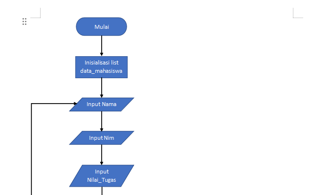
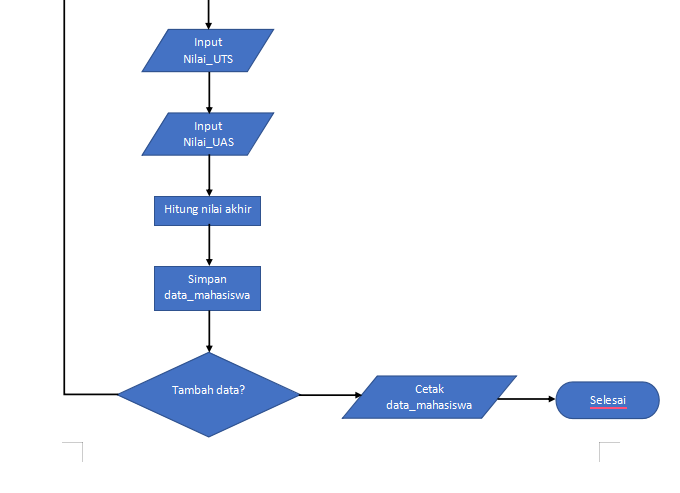
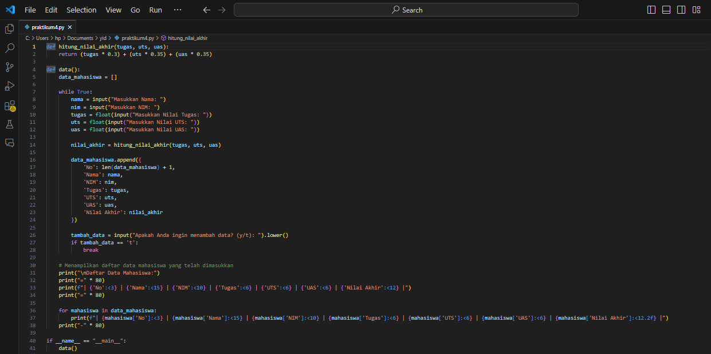
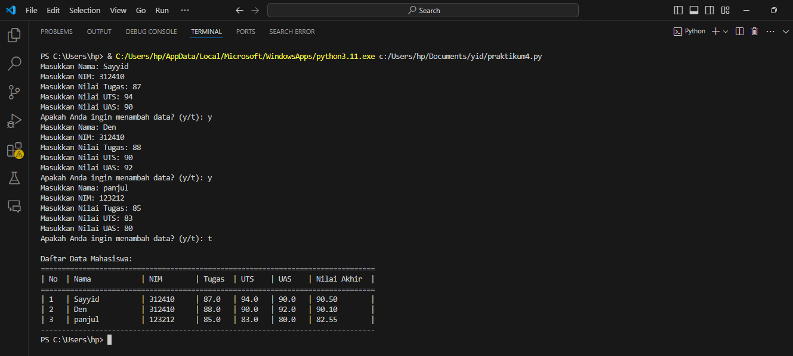

# labpy04
Nama : Sayyid Sulthan Abyan <p>
NIM : 312410496 <p>
Kelas : TI.24.A.5 <p>
Mata Kuliah : Bahasa Pemrograman <p>
# ```Menambahkan data ke dalam sebuah list:```
## flowchart


### ```Alur Algoritma```
 1. Start (Mulai):
    - Program dimulai.
 2. Inisialisasi List ```data_mahasiswa:```
    - Membuat list ```data_mahasiswa``` untuk menyimpan data mahasiswa.
 3. Input Data Mahasiswa:
    - Meminta pengguna untuk memasukkan Nama, NIM, Nilai Tugas, Nilai UTS, dan Nilai UAS.
 4. Hitung Nilai Akhir:
    - Menghitung nilai akhir menggunakan bobot yang sudah ditentukan.
 5. Simpan Data Mahasiswa:
    - Menyimpan data mahasiswa ke dalam list ```data_mahasiswa.```
 6. Tambah Data Lagi?:
    - Menanyakan apakah pengguna ingin menambah data mahasiswa lagi.
    - Jika pengguna memilih "Ya", kembali **ke langkah 3 (Input Data Mahasiswa).**
    - Jika pengguna memilih "Tidak", lanjut **ke langkah 7 (Cetak Data Mahasiswa).**
 7. Cetak Data Mahasiswa:
    - Mencetak semua data mahasiswa yang telah dimasukkan dalam format tabel.
 8. Selesai:
    - Program selesai.
   
## Program python

## Hasil eksekusi program

